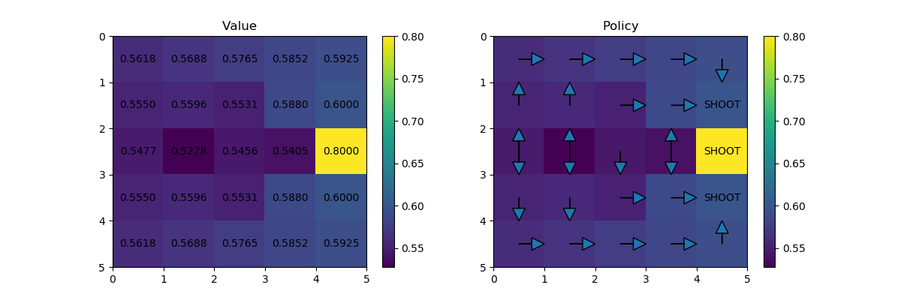

# RL for Football RoboCup 2D Half Field Offense

## Exercise 1: Simple policy iteration exercise

Based on policy iteration, which is can be expresed in solving for the optimal policy using

<!---- V(s) \left \max \sum_{s',r}p(s',r|s,\pi(s))\left[r+\gamma V(s') \right] --->
until 

is small enought, in order solve a toy example, 

The optimal policy and optimal values are

