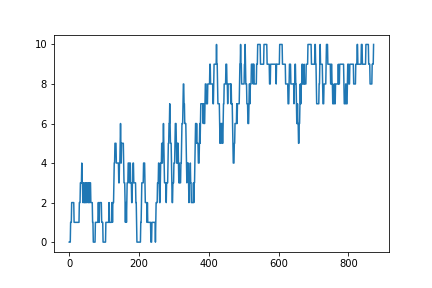
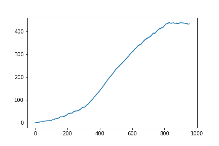
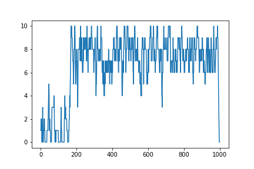
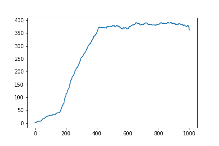
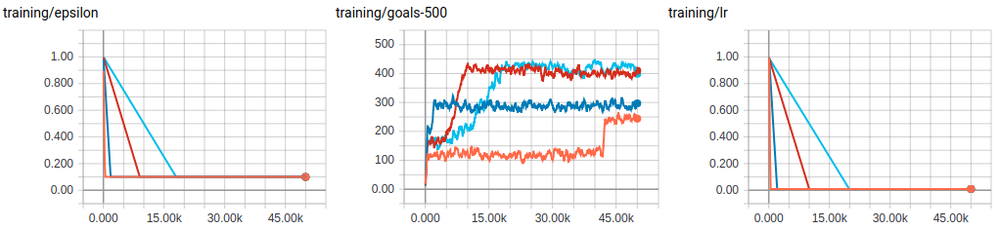

# RL for Football RoboCup 2D Half Field Offense

## Exercise 1: Simple policy iteration exercise

Based on policy iteration, which is can be expresed in solving for the optimal policy using

<!---- V(s) \left \max \sum_{s',r}p(s',r|s,\pi(s))\left[r+\gamma V(s') \right] --->
until 

is small enought, in order solve a toy example, 
The optimal policy and optimal values are

## Exercise 2: Different TD algorithms

Let's try and use this one to check the correctness implementation of the algorithms https://github.com/dennybritz/reinforcement-learning

### Q-learning algorithms 
This version is able to keep very close to the maximum of 10 goals per 10 trials, that means that in 10 trials (i.e. games) it makes close to 10 goals being 10 the maximum achivable value.

The parameters are

* Learning Rate: 0.95, with a Linear Decay Ratio of 400 episodes (that means that after 400 episodes the learning rate will be at its minimum). The Decay ratio does not decrease during its first 100 trials to improve exploration
* Minimum Learning Rate: 0.01
* Epsilon: 0.5 with the same Linear Decay as the learning rate.
* Minimum epsilon: 0.01 to avoid being stuck at certain positions for longer than 100 steps

Plot of the last 10 goals in training time:

Plot of the last 500 goals in training time:
it will always inscrease up to the episode 500, from there on it can decrease but not very fast. **The maximum is reached around 430 goals out of 500 trials**

its performance is

| metric | value |
| --- | --- |
| TotalFrames | 466007 |
| Avg Frames Per Trial | 466.0 |
| Avg Frames per Goal  | 479.7 |
| Trials | 1000 |
| Goals  | 652  |
| Defense Captured | 1 |
| Balls out of Bounds | 311 |
| Out of time | 36 |

### SARSA methods

Plot of the last 10 goals in training time:

Plot of the last 500 goals in training time:
it will always inscrease up to the episode 500, from there on it can decrease but not very fast. **The maximum is reached around 430 goals out of 500 trials**

### MonteCarlo Control with epsilon soft policies

| metric | value |
| --- | --- |
| TotalFrames | 156006 |
| Avg Frames Per Trial | 312.0 |
| Avg Frames per Goal  | 394.8 |
| Trials | 500 |
| Goals  | 49  |
| Defense Captured | 1 |
| Balls out of Bounds | 450 |
| Out of time | 0 |

## Exercise 3: Asyncronous Reinforcement Learning

The implemented version is the very first working version, therefore not the most optimal, its performance is

### To-Do

- [x] Use one hot encoding
- [x] Remove the gradients to the target (with `detach` or `need_grads=False`
- [x] Use `torch.Tensor([rewards])
- [x] Try different `I_async` and `I_something else`
- [x] Run without using the greedy policy and compare trained and not-trained models
- [x] Save the network
- [ ] Figure out how to know if player has the ball and add it to the state
- [ ] Suppose everything is 2D

### Metrics 

Without learning

| metric | value |
| --- | --- |
| TotalFrames | 616553 |
| Avg Frames Per Trial | 123.3 |
| Avg Frames per Goal  | 185.0 |
| Trials | 5001 |
| Goals  | 1811  |
| Defense Captured | 177 |
| Balls out of Bounds | 2994 |
| Out of time | 19 |

With learning

| metric | value |
| --- | --- |
| TotalFrames | xxx |
| Avg Frames Per Trial | xxx |
| Avg Frames per Goal  | xxx |
| Trials | xxx |
| Goals  | xxx |
| Defense Captured | xxx |
| Balls out of Bounds | xxx |
| Out of time | xxx |

# Multi-agent Reinforcement Learning

## Independent Q-Learning (IQL)

In this case there are two agents, the only way to score is if one player marks the enemy (there is only one defensing player) while the other shoots. for IQL the agents are not allowed to comunicate but still have to learn to act together.

The results are similar to those of QL. The agents manage to score around 410 goals out of 500 trials after 20k episodes. Here are the results varying the epsilon and lr scheduler.

